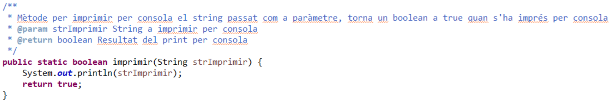
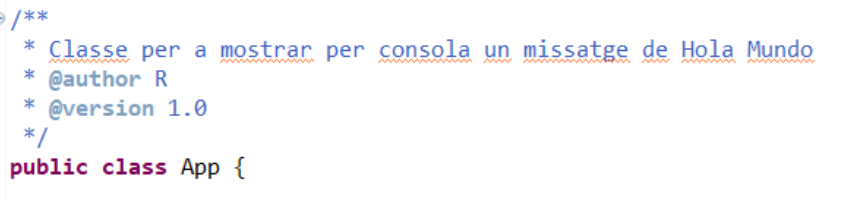

# Apuntes Java - Acceso a Datos

## Crear comentarios JavaDoc automáticamente en IntelliJ

1. Colócate justo encima de un método o clase.
2. Escribe: 
    `/**`
3. Pulsa **Enter**, IntelliJ completará la estructura del comentario con parámetros, return, etc.

    Ejemplo

    
    

## Generar .jar desde IntelliJ

1. Configura el **Artifact**
    1. Ve a **File** → **Project Structure**
    2. En el panel izquierdo, entra en **Artifacts**
    3. Pulsa **+** → **JAR**
        - **From modules with dependencies** (si quieres incluir dependencias)
        - **Empty** (si quieres configurar todo manualmente)
    4. Elige tu módulo principal
    5. Selecciona el **Main Class** (la clase con `public static void main`)
2. Construir el jar:
    - Ve a **Build** → **Build Artifacts...**
    - Selecciona tu **artifacts**: **NombreDelJar** → **Build**
    - El .jar aparecerá en la carpeta *out/artifacts*

- Asegúrate de que el **artifact** esté configurado el **Manifest** con la entrada: `Main-Class: tu.paquete.ClasePrincipal`
- Intellij lo suele añadir automáticamente cuando eliges **"From modules with dependencies"**
- Para ejecutarlo: `Java -jar NombreDelJar.jar`

## Clase File

### Crear un objeto File

```java
File archivo = new File("ruta/del/archivo.txt");
```

Ejemplo de rutas:

```java
File f1 = new File("C:/datos/ejemplo.txt");   // Windows
File f2 = new File("/home/usuario/ejemplo.txt"); // Linux
File carpeta = new File("src/main/resources");
```

### Métodos más importantes

**Comprobar si existe**

```java
archivo.exists(); // true o false
```

**Saber si es archivo o carpeta**

```java
archivo.isFile();           // ¿es un archivo?
archivo.isDirectory();      // ¿es un directorio?
```

**Crear archivos o carpetas**

```java
archivo.createNewFile();
carpeta.mkdir();
carpeta.mkdirs();
```

**Eliminar**
```java
archivo.delete();
```

**Renombrar o mover**
```java
File nuevoNombre = new File("ruta/nuevoNombre.txt");
archivo.renameTo(nuevoNombre);
```

**Obtener información**
```java
archivo.getName();              // nombre del archivo
archivo.getPath();              // ruta tal cual la diste
archivo.getAbsolutePath();      // ruta absoluta
archivo.length();               // tamaño en bytes
```

**Listar archivos dentro de una carpeta**

```java
File carpeta = new File("miCarpeta");
File[] archivos = carpeta.listFile();

for (File f : archivos) {
    System.out.println(f.getName());
}
```

**Ejemplo completo**

```java
import java.io.File;
import java.io.IOException;

public class EjemploFile {
    public static void main(String[] args) throws IOException {

        File archivo = new File("ejemplo.txt");

        if (!archivo.exists()) {
            archivo.createNewFile();
            System.out.println("Archivo creado.");
        }

        System.out.println("Nombre: " + archivo.getName());
        System.out.println("Ruta: " + archivo.getAbsolutePath());
        System.out.println("Tamaño: " + archivo.length() + " bytes");

        // Renombrar
        File nuevo = new File("nuevoEjemplo.txt");
        archivo.renameTo(nuevo);

        // Borrar
        nuevo.delete();
    }
}
```

## Clase para manejo de fechas y horas (Date, Time, ...)

`java.util.Date`
- Representa un instante en el tiempo (fecha + hora)
```java
Date fecha = new Date();
System.out.println(fecha); // Ej: Wed Nov 20 18:45:00 CET 2025
```

`java.time` **Opción recomendada**

**LocalDate**
```java
LocalDate hoy = LocalDate.now();  // fecha actual
LocalDate nacimiento = LocalDate.of(1990, 5, 15);
System.out.println(hoy); // 2025-11-20
```

**LocalTime**
```java
LocalTime horaActual = LocalTime.now();
LocalTime horaExacta = LocalTime.of(14, 30, 0);
System.out.println(horaActual);

```

**LocalDateTime**
```java
LocalDateTime fechaHora = LocalDateTime.now();
LocalDateTime evento = LocalDateTime.of(2025, 12, 25, 10, 0);
System.out.println(fechaHora);

```

**Formatear fechas**
```java
DateTimeFormatter fmt = DateTimeFormatter.ofPattern("dd/MM/yyyy HH:mm");
String texto = fechaHora.format(fmt);
System.out.println(texto); // 20/11/2025 18:45

```

**Convertir texto a fecha**
```java
String str = "25/12/2025 10:00";
DateTimeFormatter fmt2 = DateTimeFormatter.ofPattern("dd/MM/yyyy HH:mm");
LocalDateTime navidad = LocalDateTime.parse(str, fmt2);
System.out.println(navidad);

```

**Sumar/restar tiempo**
```java
LocalDate mañana = hoy.plusDays(1);
LocalDate haceUnaSemana = hoy.minusWeeks(1);

```
---
<br>
<br>

## Lectura de archivos en Java: `FileReader` y `BufferedReader`

En Java, **`FileReader`** y **`BufferedReader`** se usan para leer archivos de texto. A continuación se explica cómo funcionan y cómo se usan.

---

### 1. `FileReader`

* Pertenece a **`java.io`**.
* Sirve para **leer archivos de texto** carácter por carácter.
* Es **básico y lento**, por lo que se suele combinar con `BufferedReader`.

**Ejemplo simple:**

```java
import java.io.FileReader;
import java.io.IOException;

public class DemoFileReader {
    public static void main(String[] args) {
        try (FileReader fr = new FileReader("ejemplo.txt")) {
            int c;
            while ((c = fr.read()) != -1) { // lee un carácter a la vez
                System.out.print((char) c);
            }
        } catch (IOException e) {
            e.printStackTrace();
        }
    }
}
```

**Notas:**

* `read()` devuelve un **int**.
* Devuelve **-1** al final del archivo.
* Solo funciona con archivos de texto.

---

### 2. `BufferedReader`

* También de **`java.io`**.
* Lee **línea por línea** o en bloques.
* Internamente tiene un **buffer**, lo que lo hace más rápido.
* Se suele usar **envolviendo un `FileReader`**.

**Ejemplo:**

```java
import java.io.FileReader;
import java.io.BufferedReader;
import java.io.IOException;

public class DemoBufferedReader {
    public static void main(String[] args) {
        try (BufferedReader br = new BufferedReader(new FileReader("ejemplo.txt"))) {
            String linea;
            while ((linea = br.readLine()) != null) { // lee línea por línea
                System.out.println(linea);
            }
        } catch (IOException e) {
            e.printStackTrace();
        }
    }
}
```

**Ventajas:**

* Más rápido que `FileReader` solo.
* Permite leer líneas completas con `readLine()`.
* Reduce las llamadas al disco gracias al buffer interno.

---

### 3. Comparación rápida

| Característica | FileReader        | BufferedReader          |
| -------------- | ----------------- | ----------------------- |
| Leer por       | Carácter          | Línea o bloque          |
| Velocidad      | Lenta             | Rápida (usa buffer)     |
| Uso común      | Archivos pequeños | Archivos grandes        |
| Métodos útiles | `read()`          | `readLine()`, `ready()` |

---

### 4. Buenas prácticas

1. Usar **try-with-resources** para cerrar automáticamente los archivos.
2. Combinar `BufferedReader` con `FileReader` para archivos de texto grandes.
3. Para archivos binarios, usar `FileInputStream` en vez de `FileReader`.

---

Si quieres, también puedo hacer un **diagrama mostrando cómo FileReader y BufferedReader trabajan juntos**, para visualizar el flujo de datos y el buffer.

<br>
<br>

## Escritura de archivos en Java: `FileWriter` y `BufferedWriter`

En Java, **`FileWriter`** y **`BufferedWriter`** se usan para **escribir archivos de texto**. A continuación se explica cómo funcionan y cómo se usan.

---

### 1. `FileWriter`

* Pertenece a **`java.io`**.
* Sirve para **escribir caracteres en archivos de texto**.
* Es básico y puede ser lento para archivos grandes.
* Se puede abrir en modo **append** (agregar al final) o **sobrescribir**.

**Ejemplo simple: sobrescribir un archivo**

```java
import java.io.FileWriter;
import java.io.IOException;

public class DemoFileWriter {
    public static void main(String[] args) {
        try (FileWriter fw = new FileWriter("ejemplo.txt")) { // sobrescribe
            fw.write("Hola, mundo!\n");
            fw.write("Esta es una segunda línea.\n");
        } catch (IOException e) {
            e.printStackTrace();
        }
    }
}
```

**Notas:**

* `write()` puede escribir un **carácter, un array de caracteres o un String**.
* Por defecto, sobrescribe el archivo existente.

**Modo append (agregar al final):**

```java
FileWriter fw = new FileWriter("ejemplo.txt", true); // true = append
```

---

### 2. `BufferedWriter`

* También de **`java.io`**.
* Escribe **en bloques** usando un buffer interno, lo que mejora la velocidad.
* Se suele usar **envolviendo un `FileWriter`**.
* Permite usar `newLine()` para saltos de línea portables.

**Ejemplo: escritura eficiente línea por línea**

```java
import java.io.FileWriter;
import java.io.BufferedWriter;
import java.io.IOException;

public class DemoBufferedWriter {
    public static void main(String[] args) {
        try (BufferedWriter bw = new BufferedWriter(new FileWriter("ejemplo.txt"))) {
            bw.write("Primera línea");
            bw.newLine();
            bw.write("Segunda línea");
            bw.newLine();
        } catch (IOException e) {
            e.printStackTrace();
        }
    }
}
```

**Ventajas:**

* Más rápido que `FileWriter` solo.
* Permite escribir líneas completas fácilmente.
* Reduce las llamadas al disco gracias al buffer.

---

### 3. Comparación rápida

| Característica | FileWriter        | BufferedWriter                    |
| -------------- | ----------------- | --------------------------------- |
| Escribir por   | Carácter o String | Bloques o línea por línea         |
| Velocidad      | Lenta             | Rápida (usa buffer)               |
| Uso común      | Archivos pequeños | Archivos grandes                  |
| Métodos útiles | `write()`         | `write()`, `newLine()`, `flush()` |

---

### 4. Buenas prácticas

1. Usar **try-with-resources** para cerrar automáticamente los archivos.
2. Combinar `BufferedWriter` con `FileWriter` para archivos de texto grandes.
3. Llamar a `flush()` si quieres asegurarte de que los datos se escriban inmediatamente.
4. Para archivos binarios, usar `FileOutputStream` en vez de `FileWriter`.

---

Si quieres, también puedo hacer un **diagrama visual mostrando cómo FileWriter y BufferedWriter trabajan juntos**, igual que con la lectura, para entender el flujo de escritura y el buffer.

---

<br>
<br>

## Filtro extension

```java
package es.florida.ad_t1_1;
import java.io.File;
import java.io.FilenameFilter;

public class FiltroExtension implements FilenameFilter{
    String extension;
    FiltroExtension(String extension){
        this.extension=extension;
    }
    
    public boolean accept(File dir, String name){
        return name.endsWith(extension);
    }
}
```
---

<br>
<br>

# JAVA - SQL

## Configurar entorno

1. Ejecutar XAMPP
2. Si es necesario importar una base de datos:
    1. Abrir http://localhost/phpmyadmin/
    2. Importar
    3. Seleccionar archivo (terminado en .sql)
    4. En el final de la pagina, clicar en **Importar**
3. Descargar .jar con libreria para JDBC MySQL
    1. Abrir https://mvnrepository.com/artifact/com.mysql/mysql-connector-j/9.0.0
    2. Clicar en File - jar (2.5 MB)
4. Importar clase en IntelliJ
    1. File
    2. Project Structure
    3. Modules - Elegir el modulo en el que estamos trabajando (nombre del proyecto)
    4. Dependencies
    5. Clicar en +
    6. JAR or Directories
    7. Elegir el .jar descargadow
    8. OK
5. Importar libreria sql: `import java.sql.*;`

## Ejemplo de uso

```java
package ejerciciosSQL;
import java.sql.*;

public class Principal {
    public static void main(String[] args) {
        try {
            Class.forName("com.mysql.cj.jdbc.Driver");
            Connection con =
                    DriverManager.getConnection("jdbc:mysql://localhost:3306/world","root","");
            Statement stmt = con.createStatement();
            ResultSet rs = stmt.executeQuery("SELECT * FROM country");
            while(rs.next()) {
                System.out.println(rs.getString(1) + " " + rs.getString(2) + " " +
                        rs.getString(3) + " " + rs.getString(4) + " " + rs.getString(5) + " " +
                        rs.getString(6) + " " + rs.getString(7) + " " + rs.getString(8) + " " +
                        rs.getString(9) + " " + rs.getString(10) + " " + rs.getString(11) + " " +
                        rs.getString(12) + " " + rs.getString(13) + " " + rs.getString(14));
            }
            rs.close();
            stmt.close();
            con.close();
        } catch (Exception e) {
            System.out.println(e);
        }
    }
}

```

## Explicación conexión

Para la conexión necesitamos 2 cosas
1. Driver manejador de SQL, siempre será `Class.forName("com.mysql.cj.jdbc.Driver");`
2. Crear la conexión con la base de datos, para lo cual necesitamos 3 cosas:
    1. URL de la base de datos, siempre en el siguiente formato `jdbc:mysql://localhost:3306/nombreDeLaBase`
    2. Usuario, en nuestro caso siempre será `root`
    3. Contraseña, como usamos el usuario **root** no deberemos pasarle contraseña, por lo que pasaremos `""`
3. Para establecer la conexión, deberemos crear un objeto de la clase `Connection`, le pondremos el nombre que queramos `con` y usaremos el `DriverManager.getConnection(url, usuario, contraseña)`

Importante, la conexión y interacción con la base de datos siempre debe estar dentro de un `try-catch`

Podemos hacerlo de la siguiente forma con la base de datos world:

```java
String url = "jdbc:mysql://localhost:3306/world";
String usuario = "root"
String constraseña = "";

try {
    Class.forName("com.mysql.cj.jdbc.Driver");
    Connection con = DriverManager.getConnection(url, usuario, contraseña);
    System.out.println("Conexión realizada con éxito");
} catch (Exception e) {
    System.out.println("Error al conectar a la base de datos: " + e);
}
```

## Interacción con la base de datos:

- Creamos un objeto `Statement` el cual nos permite ejecutar consultas SQL sobre la conexión. `Statement stmt = con.createStatement();`
- Para ejecutar una consulta SQL crearemos un objeto `ResultSet` donde almacenaremos lo que nos devuelva la consulta, demeremos usar el objeto statemnt que nos hemos creado anteriormente y usar el método `.executeQuery(Sentencia SQL)`. `ResultSet rs = stmt.executeQuery("Sentencia SQL")`

```java
Statement stmt = con.createStatement();
ResultSet rs = stmt.executeQuery("SELECT * FROM contry");
```

## Importante

**Debemos cerrar todos los recursos abiertos en orden inverso**

Por ejemplo
```java
rs.close();
stmt.close();
con.close();
```

## Recoger datos de la sentencia SQL

Una vez tenemos el resultado de la sentencia SQL dentro del objeto ResultSet hacemos lo siguiente:

1. Para recorrer cada linea del resultado SQL hacemos: `while(rs.next()) {}` - rs.next() se encarga de comprobar si existe una siguiente linea.
2. Dentro del while podemos acceder a los resultados de la siguiente manera: `rs.getType(nombreColumna)` - donde **Type** es el tipo de datos y **nombreColumna** es el nombre de la columna de la tabla. 
    
    Ejemplo:
    ```java
    int id = rs.getInt("ID");
    String name = rs.getString("Name");
    ```

Ejemplo Completo:

```java
while(rs.next()) {
    int id = rs.getInt("ID");
    String name = rs.getString("Name");
    String countryCode = rs.getString("CountryCode");
    String district = rs.getString("District");
    int population = rs.getInt("Population");

    System.out.println(id + " " + name + " " + countryCode + " " + district + " " + population);
}
```

## Insertar datos o modificarlos

1. Creamos la consulta SQL con un objeto `PreparedStatement`, usamos el metodo `.preparedStatement(SentenciaSQL)`

    ```java
    PreparedStatement psInsertar = con.prepareStatement("INSERT INTO tabla (campo1, campo2, ....) VALUES (?, ?, ...)");
    ```

    Esta consulta no lleva valores directamente, sino marcadores `?`
    
    `?` indica que los valores se pondrán despues 
2. Insertamos los datos a la consulta creada. Deberemos usar el metodo `setType(posValor, valor)`, donde:

    - `setType`: **Type** será el tipo de datos que vamos a insertar - setInt() - setString()
    - `posValor`: posicion del dato que vamos a insertar, por ejemplo si ponemos `1`, se pondrá en la primera posición `campo1` en este caso.
    - `valor`: valor que vamos a insertar en ese campo.

    Ejemplo:

    ```java
    psInsertar.setString(1, valorCampo1);
    psInsertar.setString(2, valorCampo2);
    ```
3. Ejecutamos la sentencia con el metodo .executeUpdate(); 

    - Usamos .executeUpdate() porque ser una sentencia de modificación (INSERT, UPDATE, DELETE)
    - Devolverá un **int** con el número de filas afectadas, por lo que deberemos guardarlo en una variable.

    ```java
    int resultadoInsertar = psInsertar.executeUpdate();
    ```
---
<br>
<br>

# Resumen de Sentencias SQL

```sql
-- CREACIÓN DE TABLAS
CREATE TABLE nombre_tabla (
    columna1 INT PRIMARY KEY,
    columna2 VARCHAR(100) NOT NULL,
    columna3 DATE,
    columna4 DECIMAL(10,2)
);

-- MODIFICACIÓN DE TABLAS
ALTER TABLE nombre_tabla ADD COLUMN columna5 TEXT;
ALTER TABLE nombre_tabla DROP COLUMN columna2;
ALTER TABLE nombre_tabla MODIFY COLUMN columna3 DATETIME;
ALTER TABLE nombre_tabla RENAME TO nueva_tabla;

-- INSERCIÓN DE DATOS
INSERT INTO nombre_tabla (columna1, columna2, columna3) VALUES (1, 'Texto', '2025-01-01');
INSERT INTO nombre_tabla (columna1, columna2, columna3) 
VALUES (2, 'Otro', '2025-02-01'), (3, 'Más', '2025-03-01');

-- SELECCIÓN DE DATOS
SELECT * FROM nombre_tabla;
SELECT columna1, columna2 FROM nombre_tabla;
SELECT * FROM nombre_tabla WHERE columna1 > 10;
SELECT * FROM nombre_tabla ORDER BY columna2 ASC;
SELECT * FROM nombre_tabla LIMIT 5;
SELECT * FROM nombre_tabla WHERE columna2 LIKE 'A%' AND columna3 BETWEEN '2025-01-01' AND '2025-12-31';

-- ACTUALIZACIÓN DE DATOS
UPDATE nombre_tabla SET columna2 = 'NuevoValor' WHERE columna1 = 1;
UPDATE nombre_tabla SET columna2 = 'Valor', columna3 = '2025-06-01' WHERE columna1 = 2;

-- ELIMINACIÓN DE DATOS
DELETE FROM nombre_tabla WHERE columna1 = 1;
DELETE FROM nombre_tabla;
DROP TABLE nombre_tabla;

-- FUNCIONES DE AGREGACIÓN
SELECT COUNT(*) FROM nombre_tabla;
SELECT SUM(columna4), AVG(columna4), MAX(columna4), MIN(columna4) FROM nombre_tabla;
SELECT columna2, COUNT(*) FROM nombre_tabla GROUP BY columna2;
SELECT columna2, COUNT(*) FROM nombre_tabla GROUP BY columna2 HAVING COUNT(*) > 1;

-- JOINS
SELECT a.columna1, b.columna2 FROM tabla1 a INNER JOIN tabla2 b ON a.id = b.tabla1_id;
SELECT a.columna1, b.columna2 FROM tabla1 a LEFT JOIN tabla2 b ON a.id = b.tabla1_id;
SELECT a.columna1, b.columna2 FROM tabla1 a RIGHT JOIN tabla2 b ON a.id = b.tabla1_id;

-- ÍNDICES Y CLAVES
CREATE INDEX idx_columna2 ON nombre_tabla(columna2);
ALTER TABLE tabla_hija ADD CONSTRAINT fk_columna FOREIGN KEY (columna_fk) REFERENCES tabla_padre(columna_pk);

-- CONSULTAS AVANZADAS
SELECT * FROM nombre_tabla WHERE columna1 IN (SELECT columna1 FROM otra_tabla WHERE columna2 = 'Valor');
SELECT columna1, CASE WHEN columna2 = 'A' THEN 'Tipo A' WHEN columna2 = 'B' THEN 'Tipo B' ELSE 'Otro' END AS tipo FROM nombre_tabla;
SELECT columna1 FROM tabla1 UNION SELECT columna1 FROM tabla2;

